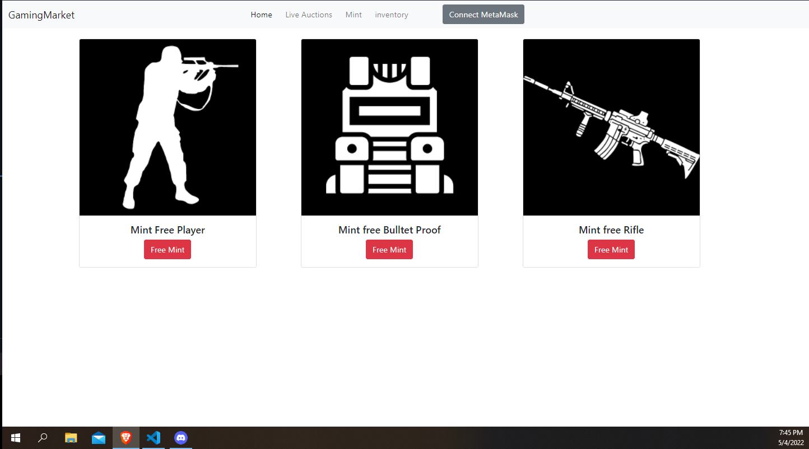
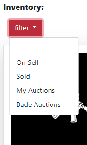
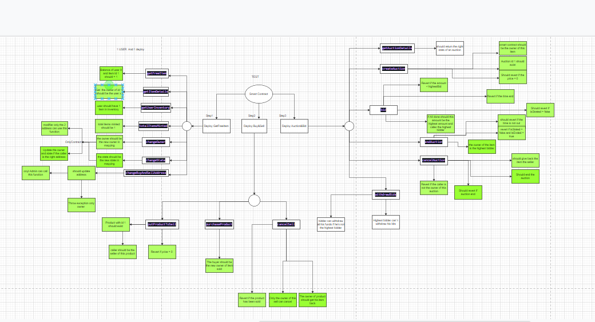

# Take a tour : 
    https://gameitem.netlify.app/getfreeitem

# Disclaimer

    - For educational purpose only, I created this project to improve my skills in web3 development using Solidity, Hardhat, Ethers, Bootstrap, HTML, CSS.
    If you have a question about something you couldn't understand, or you need a help to fix something, or even you have some additional features please contact me Mowgli#7713 or TG : @mowgli_9.
    I'm looking for a real project or a job in a company ^^.
    

# Overview

    This  advanced marketplace use ERC1155 to sell, buy, and make auction for a NFT.
    Main Functions are  :
        Buy : 
            You can buy any NFT listed on the marketplace.
        Sell :
            You can sell only NFTs you hold.
            You can't sell it for 0 ethers.
            Not only that, but you can't sell a NFT already on sell or in auction.
        Auction :
            You can put only your NFT to auction.
            Minimum bid must be greater than 0.
            You can only cancel the auction if nobody bids.
            You can only end the auction when the time  end.
            You can bid only on !end auctions.
            You can bid only with a price higher than the highest price.
            You can withdraw your bids only if you're not the highest bidder.
            Anybody can end the auction when the time passed.

# Guide

    First, you need to connect your Metamask wallet, you mint a free NFT.
    You can see your NFT in inventory as  <available>.
    You can sell your NFT by clicking on sell button, then you can see it <on sell>.
    You can buy a NFT, then  you can see it <available>.
    When you sell a NFT, you will see it <sold>.
    When you put NFT in auction, you can see it < my Auctions>.
    When you bid, you can see the auction <Bade Auction>.
    You can withdraw your funds in an auction only when you're not the highest bidder.

# Smart Contract :

    I create this contract from scratch, built on ERC1155 from OppenZeppelin.
    I used interfaces to make code more clean and more reusable.
    All functions in the smart contract are explained using comments (I tried the max ^^').
    Please, if you have a question, contact me on : DS = Mowgli#7713 or TG = @mowgli_9.
    Smart contract passed 33 different test.
    
 
 
